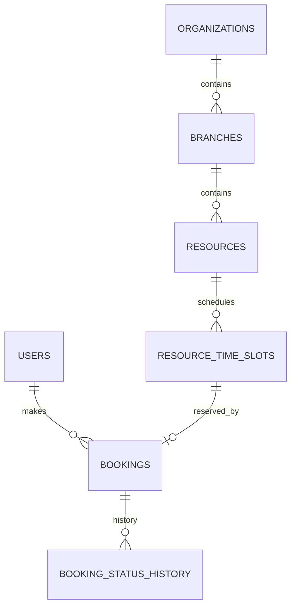

# ERD (Mermaid)

Референс‑ERD (адаптируйте под вашу реализацию):

```mermaid
erDiagram
  ORGANIZATIONS ||--o{ BRANCHES : contains
  BRANCHES ||--o{ RESOURCES : contains
  RESOURCES ||--o{ RESOURCE_TIME_SLOTS : schedules
  USERS ||--o{ BOOKINGS : makes
  RESOURCE_TIME_SLOTS ||--o| BOOKINGS : reserved_by
  BOOKINGS ||--o{ BOOKING_STATUS_HISTORY : history
```
